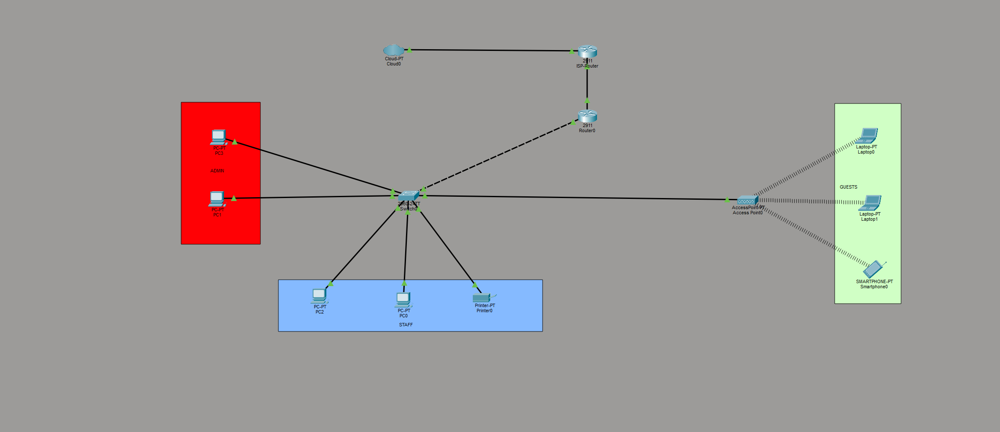
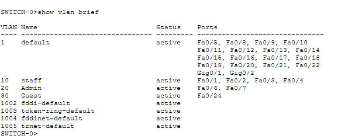
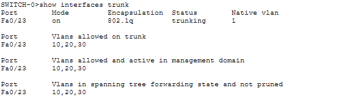
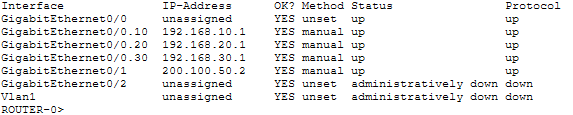
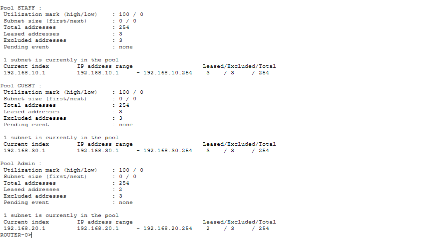
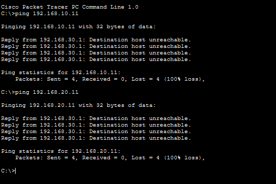
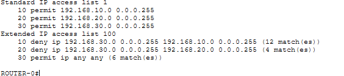

# Small Enterprise Network Design & Configuration

## 📌 Project Overview

This project is a small enterprise network designed and configured using **Cisco Packet Tracer**.

The network demonstrates VLAN segmentation, DHCP, Inter-VLAN Routing, wireless connectivity, and basic network security using ACLs.

---

## 🗺️ Network Topology

The network consists of:

* Cisco Router
* ISP Router
* Cloud
* Cisco Switch
* Staff PCs
* Admin PCs
* Printer
* Wireless Access Point
* Guest Wireless Devices



---

## 🔹 VLAN Configuration

The network is divided into three VLANs:

| VLAN | Name  | Purpose                | Network         |
| ---- | ----- | ---------------------- | --------------- |
| 10   | STAFF | Staff PCs & Printer    | 192.168.10.0/24 |
| 20   | Admin | Administrative Devices | 192.168.20.0/24 |
| 30   | Guest | Wireless Guest Devices | 192.168.30.0/24 |



---

## 🔗 Trunk Configuration

The switch-to-router connection uses trunking to carry traffic for multiple VLANs.

```cisco
interface fa0/23
switchport mode trunk
```



---

## 🌐 Inter-VLAN Routing

Router-on-a-Stick was configured using subinterfaces.

### VLAN 10 – STAFF

```cisco
interface g0/0.10
encapsulation dot1Q 10
ip address 192.168.10.1 255.255.255.0
```

### VLAN 20 – Admin

```cisco
interface g0/0.20
encapsulation dot1Q 20
ip address 192.168.20.1 255.255.255.0
```

### VLAN 30 – Guest

```cisco
interface g0/0.30
encapsulation dot1Q 30
ip address 192.168.30.1 255.255.255.0
```



---

## 📡 DHCP Configuration

DHCP was configured for each VLAN to automatically assign IP addresses.

### STAFF

```cisco
ip dhcp pool STAFF
network 192.168.10.0 255.255.255.0
default-router 192.168.10.1
```

### Admin

```cisco
ip dhcp pool ADMIN
network 192.168.20.0 255.255.255.0
default-router 192.168.20.1
```

### Guest

```cisco
ip dhcp pool GUEST
network 192.168.30.0 255.255.255.0
default-router 192.168.30.1
```



---

## 🔐 Guest Network Isolation

The Guest VLAN was isolated from the internal Staff and Admin networks using an Extended ACL.

```cisco
access-list 100 deny ip 192.168.30.0 0.0.0.255 192.168.10.0 0.0.0.255
access-list 100 deny ip 192.168.30.0 0.0.0.255 192.168.20.0 0.0.0.255
access-list 100 permit ip any any
```

The ACL was applied to the Guest subinterface:

```cisco
interface g0/0.30
ip access-group 100 in
```

This prevents Guest devices from accessing the Staff and Admin networks.



---

## 🧪 Network Testing

The network was tested using:

```cisco
show vlan brief
show interfaces trunk
show ip interface brief
show ip dhcp pool
show access-lists
```

Connectivity was also tested using `ping`.

### Guest → STAFF

```text
Failed / Blocked ❌
```

### Guest → Admin

```text
Failed / Blocked ❌
```

The ACL hit counters were verified using:

```cisco
show access-lists
```

The increasing match count confirmed that the Guest traffic was being blocked by the ACL.


---

## 🛠️ Troubleshooting

During the project, VLAN 10 devices initially failed to obtain IP addresses through DHCP.

The issue was identified as a missing DHCP pool for the STAFF network.

After configuring:

```cisco
ip dhcp pool STAFF
network 192.168.10.0 255.255.255.0
default-router 192.168.10.1
```

the STAFF devices successfully received IP addresses automatically.

---

## 🧰 Technologies & Tools

* Cisco Packet Tracer
* Cisco IOS
* VLAN
* DHCP
* Router-on-a-Stick
* Inter-VLAN Routing
* 802.1Q Trunking
* Access Control Lists (ACL)
* Wireless Networking
* Network Troubleshooting

---

## 📚 Learning Outcomes

This project provided hands-on practice with:

* VLAN creation and segmentation
* Cisco switch configuration
* Router configuration
* DHCP configuration
* Inter-VLAN Routing
* Trunk and Access Port configuration
* Wireless networking
* Basic network security with ACLs
* Network troubleshooting and verification

---

## 📁 Project Files

* `Packet-Tracer/` — Cisco Packet Tracer project file
* `Screenshots/` — Network configuration and testing screenshots
* `README.md` — Project documentation

---

## 📌 Project Type

**Personal Networking Project**

Designed and configured using **Cisco Packet Tracer**.
